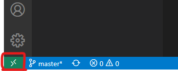
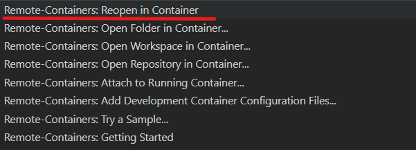

# devcontainer for Terraform and Azure
You can get started the following things instantly after fork and git clone. The [VS Code Remote Development (Remote - Containers)](https://code.visualstudio.com/docs/remote/containers) enables us to do these with few installation.

- Manage Azure by Terraform 
  - `terraform` and Azure CLI `az` command are already installed on Docker container
- Run it on GitHub Actions

# Get started

## Requirement

Prepare the followings, 

1. Visual Studio Code : https://code.visualstudio.com/download
1. VS Code Extension : [VS Code Remote Development (Remote - Containers)](https://code.visualstudio.com/docs/remote/containers)
1. Docker Desktop (in any OS) : https://www.docker.com/get-started

That's all!

## Let's get started
1. Confirm that the Docker Desktop is running.
1. Fork this repository on GitHub (recommend fork to to your private repository just to avoid something like a key leakage).
1. Git clone to your local.
    ```sh
    git clone <your repository>
    ```
1. Open VS code on your repository directory, and click Remote Development icon at the bottom left. (Or, you can open the following step from Command Palette as well)  
    
1. Select `Remote-Containers: Reopen in Containers...` on the launched menu  
    
1. Open terminal in VS Code and try...  
    ```sh
    $ terraform -v
    Terraform v0.13.5
    
    $ az --version
    azure-cli                          2.14.2
    ...
    ```
    Yes! You are ready to go!

    FYI: Also `tflint` and `terragrunt` are installed. See also the [Dockerfile](.devcontainer/Dockerfile) for the detail.

# Go for Azure

## Terraform backends on Azure Storage
First, let's get start from the creating the [Terraform backends on Azure Storage](https://www.terraform.io/docs/backends/types/azurerm.html).

1. Open the VS code terminal. You are now in repository home.
    ```sh
    $ pwd
    /workspace/<your repository name>
    ```
1. Login to Azure. You will be ask to open the login page and enter the given code (the part `************` in below).
    ```sh
    $ az login
    To sign in, use a web browser to open the page https://microsoft.com/devicelogin and enter the code ************ to authenticate.
    ```
    If login succeeded, you will see the Azure subscription list in JSON format.
1. Select the appropriate subscription and run this with GUID on `id` property.
    ```sh
    $ az account set --subscription <your subscription GUID>
    ```
1. Go to the below directory.
    ```sh
    $ cd 00-create-azurerm-backend
    ```
1. Run the `terraform init`
    ```sh
    $ terraform init

    Initializing the backend...

    Initializing provider plugins...

    Terraform has been successfully initialized!

    You may now begin working with Terraform. Try running "terraform plan" to see
    any changes that are required for your infrastructure. All Terraform commands
    should now work.

    If you ever set or change modules or backend configuration for Terraform,
    rerun this command to reinitialize your working directory. If you forget, other
    commands will detect it and remind you to do so if necessary.
   ```
1. Run the `terraform plan`, and you will be asked the name of storage account. Try the one to be unique globally.
    ```sh
    $ terraform plan

    var.backend_storage_account_name
    Storage account name for terraform backend

    Enter a value: ****
    ```
    Okay if you see this terraform plan output.
    ```
    ...
    ...
    Plan: 3 to add, 0 to change, 0 to destroy.
    ```

    Notice: If you are not login to Azure, you will see this error message. Please go back to `az login`.
    ```
    Error: Error building AzureRM Client: Authenticating using the Azure CLI is only supported as a User (not a Service Principal).
    ```
1. Run the `terraform apply`, and you will be asked the name of storage account again. Entry the same one.
    ```sh
    $ terraform apply

    var.backend_storage_account_name
    Storage account name for terraform backend

    Enter a value: ****
    ```
    You will be asked the confirmation message. Entry `yes` if okay.
    ```sh
    ...
    ...
    Plan: 3 to add, 0 to change, 0 to destroy.

    Do you want to perform these actions?
    Terraform will perform the actions described above.
    Only 'yes' will be accepted to approve.

    Enter a value: yes
    ```
    Wait a little...
    ```
    azurerm_resource_group.rg: Creating...
    azurerm_resource_group.rg: Creation complete after 0s [id=/subscriptions/****GUID****/resourceGroups/terraform-rg]
    azurerm_storage_account.strg: Creating...
    azurerm_storage_account.strg: Still creating... [10s elapsed]
    azurerm_storage_account.strg: Still creating... [20s elapsed]
    azurerm_storage_account.strg: Creation complete after 20s [id=/subscriptions/****GUID****/resourceGroups/terraform-rg/providers/Microsoft.Storage/storageAccounts/****your storage account name****]
    azurerm_storage_container.strg-container: Creating...
    azurerm_storage_container.strg-container: Creation complete after 0s [id=https://********.blob.core.windows.net/tfstate]
    ```

    Finished!
    ```
    Apply complete! Resources: 3 added, 0 changed, 0 destroyed.
    ```
1. Check if the storage account is created.
    ```sh
    $ az group show --name terraform-rg --out table
    (result)
    
    $ az storage account show --name '<replace by yours>' --out table
    (result)
    ```

# Go for GitHub Actions

(if you know how, you can jump to this workflow file)
[.github/workflows/01-hello-azure.yml]

## Prepare remote terraform state file on Azure blob storage 

1. Store an Azure auth information meaning Service Principal on GitHub secrets
replace the part of `<yourServicePrincipalName>`.
    ```sh
    az ad sp create-for-rbac --name "<yourServicePrincipalName>" --role contributor --sdk-auth
    ```
    if you run above, the follwoing JSON result are returned. We will use this later.
    ```
    {
      "clientId": "XXXXXXX-XXXX-XXXX-XXXX-XXXXXXXXXXXXX",
      "clientSecret": "XXXXXXXXXXXXXXXXXXXXXXXXXXXXX",
      "subscriptionId": "XXXXXXXXX-XXXXX-XXXX-XXXX-XXXXXXXXXXXXX",
      "tenantId": "XXXXXXXX-XXXXX-XXXX-XXXX-XXXXXXXXXXX",
      ...
    }
    ```
2. From GitHub repository menu, select `Settings` ⇒ `Secrets`. And add following 4 secretes by these name.
    - `ARM_CLIENT_ID`
    - `ARM_CLIENT_SECRET`
    - `ARM_SUBSCRIPTION_ID`
    - `ARM_TENANT_ID`

3. Extracting from [01-hello-azure.yml](.github/workflows/01-hello-azure.yml) workflow file, add 4 env variables like below.

    ```
    env:
      tf_version: 'latest'
      tf_working_dir: '01-hello-azure'
      GITHUB_TOKEN: ${{ secrets.GITHUB_TOKEN }}
      # add below 4 lines from the result of "az ad sp create-for-rbac ..."
      ARM_SUBSCRIPTION_ID: ${{ secrets.ARM_SUBSCRIPTION_ID }}
      ARM_CLIENT_ID: ${{ secrets.ARM_CLIENT_ID }}
      ARM_CLIENT_SECRET: ${{ secrets.ARM_CLIENT_SECRET }}
      ARM_TENANT_ID: ${{ secrets.ARM_TENANT_ID }}
    ```
    Then, put use phrase `hashicorp/setup-terraform@v1` before each terraform commands.
    ```
    - name: "Terraform Setup"
      uses: hashicorp/setup-terraform@v1
      with:
        terraform_version: ${{ env.tf_version }}
    ```
    Run each terraform commands. e.g. init, plan, apply  
    - If you put if block for push condition, you can avoid apply execution when it's just pull request. And the apply will be run when it's merged.
    - Also, it's important to give `-auto-approve` option. Otherwise, the workflow process will wait 'yes' input.
    ```
    - if: github.event_name == 'push'
      name: 'Terraform Apply'
      run: terraform apply -auto-approve
      working-directory: ${{ env.tf_working_dir }}
    ```

## Specify the state file

Specify where is the state file, when you run `terraform init`.
You can define state file configuration by hcl file.

[01-hello-azure/backend-prod.hcl](01-hello-azure/backend-prod.hcl)

```
resource_group_name  = "terraform-rg"
storage_account_name = "tfstatehoisjp" # replace here by yours
container_name       = "tfstate"
key                  = "terraform.tfstate.00-hello-azure"
```

specify the file path with `-backend-config` option.

```
$ terraform init -backend-config=backend-prod.hcl

Initializing the backend...

Successfully configured the backend "azurerm"! Terraform will automatically
use this backend unless the backend configuration changes.

Initializing provider plugins...
- Finding hashicorp/azurerm versions matching "~> 2.71.0"...
- Installing hashicorp/azurerm v2.71.0...
- Installed hashicorp/azurerm v2.71.0 (signed by HashiCorp)

Terraform has created a lock file .terraform.lock.hcl to record the provider
selections it made above. Include this file in your version control repository
so that Terraform can guarantee to make the same selections by default when
you run "terraform init" in the future.

Terraform has been successfully initialized!

You may now begin working with Terraform. Try running "terraform plan" to see
any changes that are required for your infrastructure. All Terraform commands
should now work.

If you ever set or change modules or backend configuration for Terraform,
rerun this command to reinitialize your working directory. If you forget, other
commands will detect it and remind you to do so if necessary.
```

On the workflow file, you can run terraform init like below.

[.github/workflows/01-hello-azure.yml](.github/workflows/01-hello-azure.yml)

```
    - name: 'Terraform Init'
      run: terraform init -backend-config=backend-prod.hcl
      working-directory: ${{ env.tf_working_dir }}
```

# Customize
You want to customize? Check these files. These are the tricks. See also the [VS Code document](https://code.visualstudio.com/docs/remote/containers) how to customize.

- [.devcontainer/devcontainer.json](.devcontainer/devcontainer.json)
- [.devcontainer/Dockerfile](.devcontainer/Dockerfile)

## Personalize by dotfiles

You can personalize by dotfiles mechanism as you like it.

[.devcontainer/devcontainer.json](.devcontainer/devcontainer.json)
```json
    "settings": {
        // ...
        // dotfiles
        "dotfiles.repository": "hoisjp/terraform-azure-ghactions-devcontainer", // change here to your repository.
        "dotfiles.targetPath": "~/.devcontainer/dotfiles",
        "dotfiles.installCommand": "~/.devcontainer/dotfiles/install.sh"
    },
```

- [Personalizing with dotfile repositories](https://code.visualstudio.com/docs/remote/containers#_personalizing-with-dotfile-repositories)

# Reference

## VS Code docs

- Developing inside a Container : https://code.visualstudio.com/docs/remote/containers

## Terraform for Azure

- https://docs.microsoft.com/en-us/azure/developer/terraform/
- Terraform - Azure Provider : https://www.terraform.io/docs/providers/azurerm/index.html
- [Terraform - Azure Provider - GitHub Repos](https://github.com/terraform-providers/terraform-provider-azurerm)
- [Terraform - Azure Provider - GitHub Repos - Examples](https://github.com/terraform-providers/terraform-provider-azurerm/tree/master/examples)
